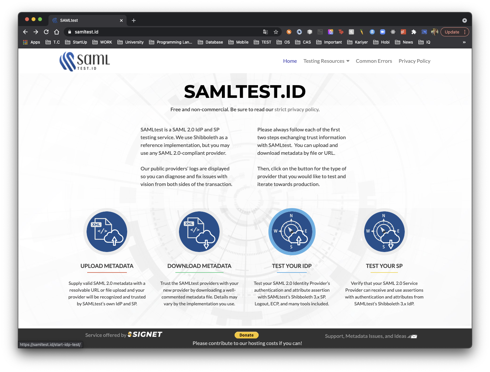
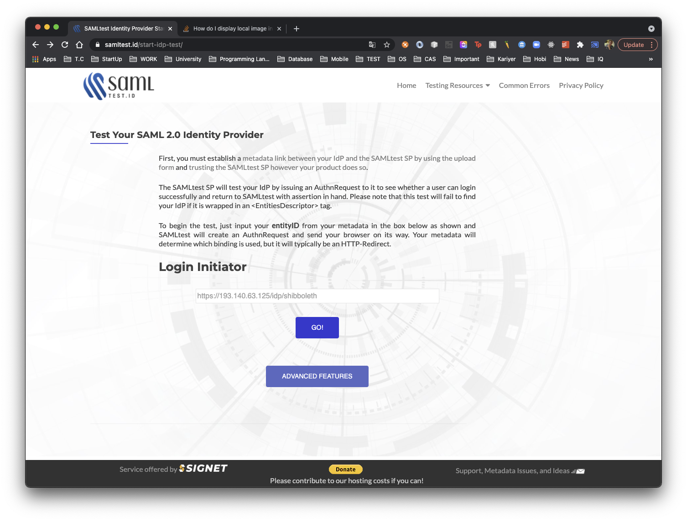
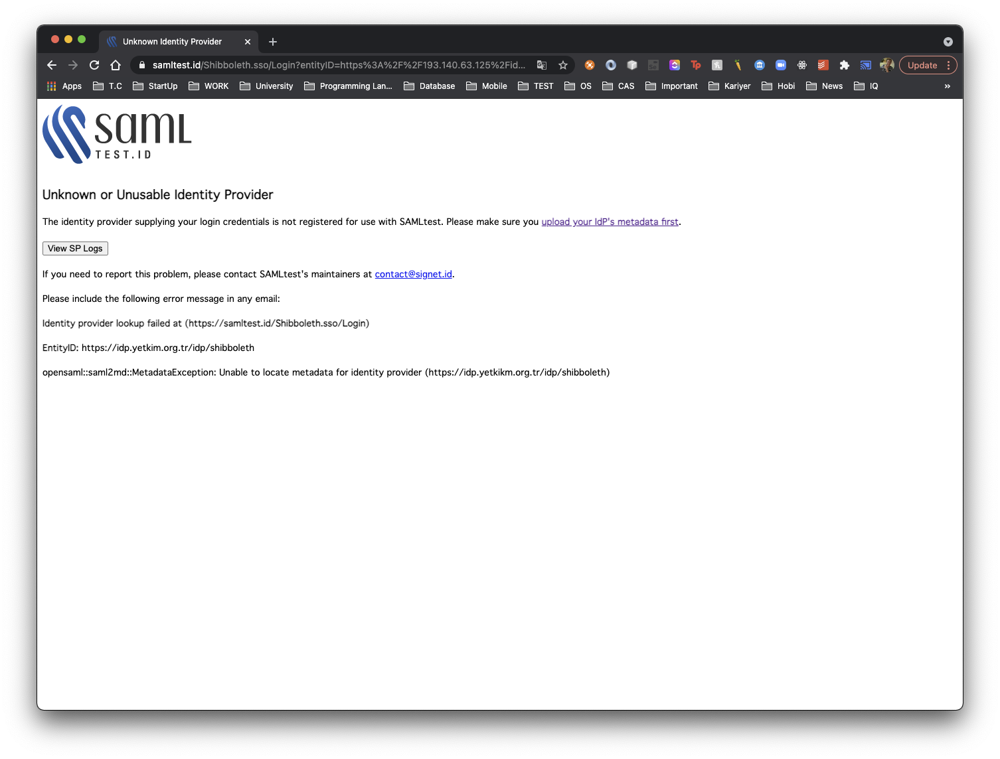
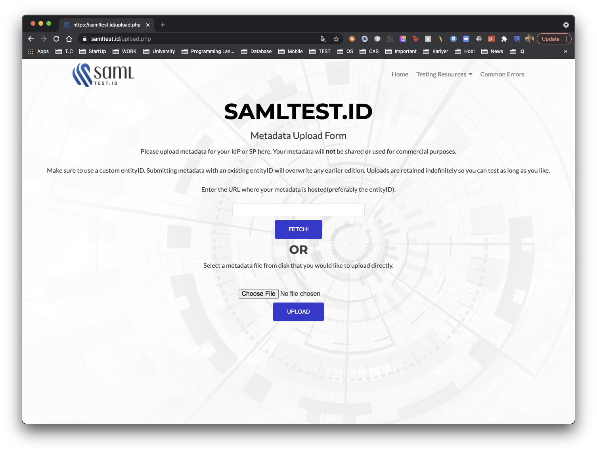
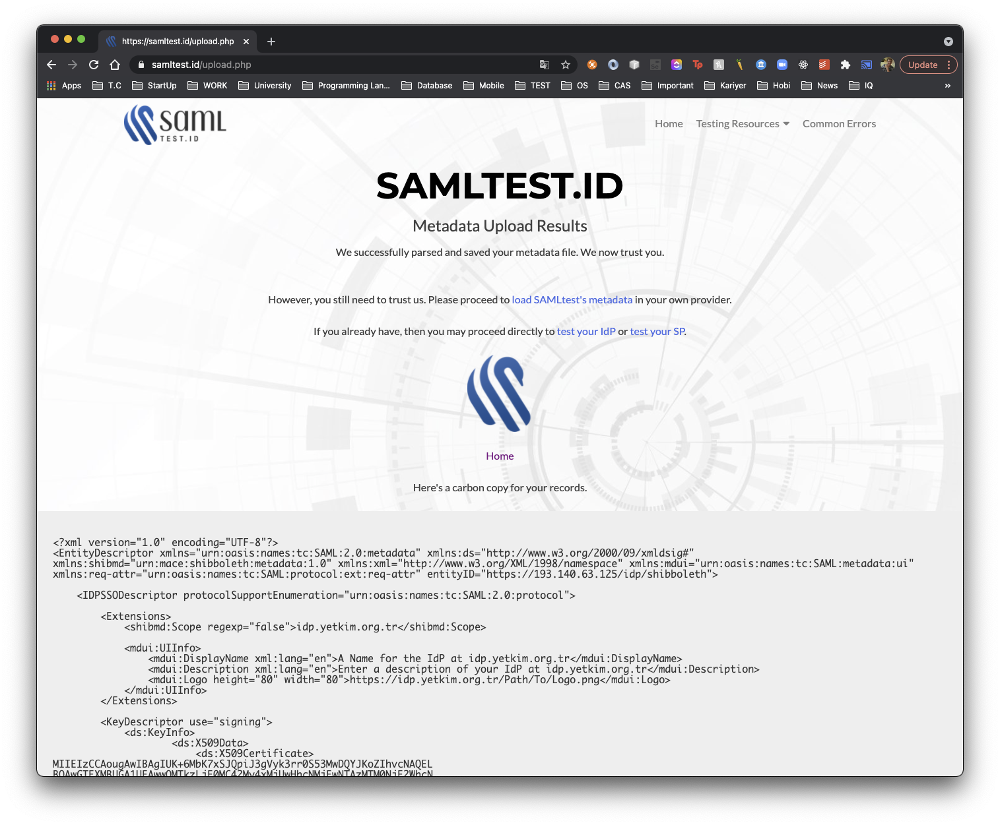
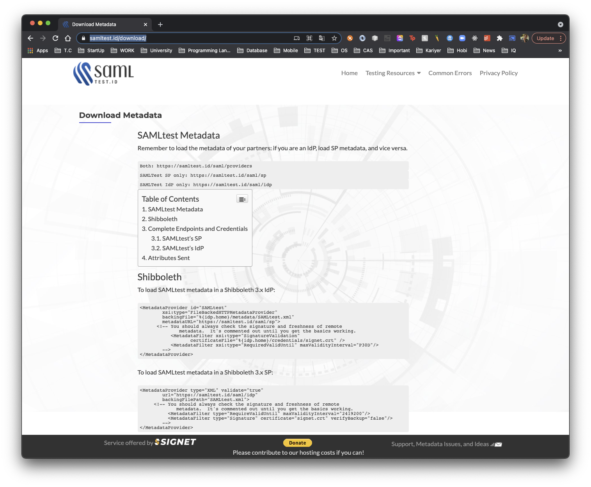

# Shibboleth IDP v4.1.0 SAML TEST


## İçindekiler
1. [Gereksinimler](#gereksinimler)
	1. [Donanım](#donanım)
	2. [Diğer](#diğer)
2. [SAML TEST](#saml-test)
3. [Kullanışlı Kaynaklar](#kullanışlı-kaynaklar)
	

## Gereksinimler

### Donanım
 * CPU: 2 Core (64 bit)
 * RAM: 4 GB
 * HDD: 20 GB
 * OS: Ubuntu 20.04 LTS
 
### Diğer
 * Shibboleth IDP v4.1.0 kurulumunun gerçekleştirilmiş olması gerekmektedir.


## SAML TEST 
1. YETKİM Federasyonuna katılmadan önce aşağıdaki https://samltest.id/ üzerinden Kimlik Sağlayacı (IDP) test edilebilir. Burada ilk hata olarak metadata yüklenememesi alınır. 
	    
	    
	    

2. IDP test edilebilmesi için metadata'nın yüklenmesi gerekmektedir. https://samltest.id/upload.php üzerinden metadata yüklenebilir.
	    
	    

3. IDP metadatası SAML TEST ortamına yüklendi ancak kimlik sağlayıcısının da SAML TEST metadatasına güvenebilmesi için metadatanın kimlik sağlayıcıya eklenmesi gerekmektedir. https://samltest.id/download/ linki üzerinden SAML TEST metadatası alınabilir.
        

	Dikkat edilecek olunursa IDP test edilecekse SP, SP test edilecekse IDP metadatası `metadata provider` olarak eklenmelidir.
	
4. Metadata provider düzenlenmesi gerekir.

    Metadata provider düzenlenmeden önce SAML TEST sertifikası yüklenmesi gerekir.
    ``` shell
    vim opt/shibboleth-idp/metadata/saml-test-cert.pem
    ```
   
   Sertifika yüklendikten sonra Metadata provider düzenlenir.
    ``` shell
    vim /opt/shibboleth-idp/conf/metadata-providers.xml
    ```
    `Metadata Provider` olarak SAML TEST SP metadatası eklenir.
       
        <MetadataProvider id="SAMLtest" xsi:type="FileBackedHTTPMetadataProvider"
           backingFile="%{idp.home}/metadata/SAMLtest.xml"
           metadataURL="https://samltest.id/saml/sp">
            <MetadataFilter xsi:type="SignatureValidation" certificateFile="%{idp.home}/metadata/saml-test-cert.pem" />
            <MetadataFilter xsi:type="RequiredValidUntil" maxValidityInterval="P30D"/>
        </MetadataProvider>


5. Servis tekrardan başlatılarak durumu kontrol edilir.
	``` shell 
	systemctl restart jetty.service
	bash /opt/shibboleth-idp/bin/status.sh
	```

    
## Kullanışlı Kaynaklar
- https://samltest.id/

