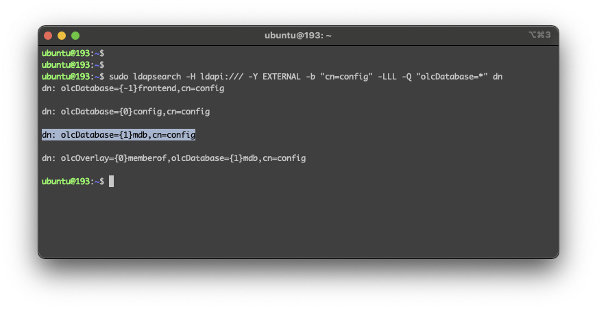
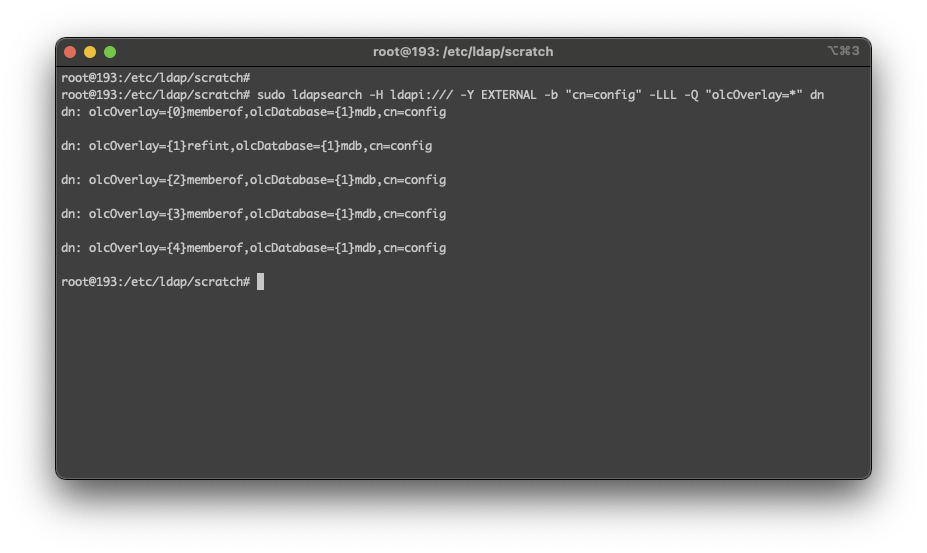

# Ubuntu 20.04 LTS LDAP kurulumu


## İçindekiler

1. [Gereksinimler](#gereksinimler)
	1. [Donanım](#donanım)
2. [Kurulacak Yazılımlar](#kurulacak-yazılımlar)
3. [Kurulum Komutları](#kurulum-komutları)
	1. [Yazılım Gereksinimlerinin Yüklenmesi](#yazılım-gereksinimlerinin-yüklenmesi)
4. [LDAP Yapılandırma](#ldap-yapılandırma)
	1. [LDAP Kurulumu](#ldap-kurulumu)
	2. [LDAP Konfigürasyon](#ldap-konfigürasyon)
5. [Kullanışlı Kaynaklar](#kullanışlı-kaynaklar)
	1. [LDIF](#ldif)
	2. [LDAP Araçları](#ldap-araçları)


## Gereksinimler

### Donanım

 * CPU: 2 Core (64 bit)
 * RAM: 4 GB
 * OS: Ubuntu 20.04 LTS


## Kurulacak Yazılımlar
 * vim
 * openssl
 * slapd
 * ldap-utils


## Kurulum Komutları

### Yazılım Gereksinimlerinin Yüklenmesi
1. Paketlerin yüklenmesi için ROOT kullanıcısı olunur. 
	``` shell 
	sudo su -
	```
	
2. Paketler güncellenir
	``` shell 
	apt update && apt-get upgrade -y --no-install-recommends
	```

3. Kurulum için gerekli olan paketler yüklenir
	```shell
	sudo apt-get install vim openssl slapd ldap-utils
	sudo dpkg-reconfigure slapd
	```

	`ldap-utils` ile ldapadd, ldapmodify gibi komutların eklenmesi sağlanır

	LDAP kurulumu sırasında admin kullanıcısı için şifre isteyecektir. LDAP server için admin password `root` olarak ayarlanmıştır. 

4. Konfigürasyonlarda kullanılmak amacıyla için `hostname` ayarlanır. 
	``` shell 
	sudo vim /etc/hosts
	```
	
	`/etc/hosts` dosyasına aşağıdaki satır eklenir. `<IP ADDRESS>` ve `<HOSTNAME>` değerleri makinanın kendisine göre ayarlanmalıdır.

		<IP ADDRESS> idp.example.org <HOSTNAME>

	Daha sonra `hostname` komut satırlarında kullanabilmemiz için ayarlarnır.
	``` shell 
	sudo hostnamectl set-hostname <HOSTNAME>
	```

	Aşağıdaki komut sonucunda komut satırı için ayarladığımız `<HOSTNAME>` değeri yazdırılmalıdır.
	``` shell 
	echo $(hostname -f)
	```


## LDAP Yapılandırma

### LDAP Kurulumu
1. LDAP kurulumu gerçekleştirildikten sonra LDAP ayağa kaldırılır.
	```shell
	sudo systemctl enable slapd
	sudo systemctl start slapd
	sudo systemctl status slapd
	```

2. LDAP ayağa kalktığını gördükten sonra LDAP'ta hangi veritabanlarının (database) olduğuna bakılır. Buna bakılmasının sebebi farklı işletim sistemlerinden farklı `olcDatabase` bulunmaktadır. Örneğin CentOS 7'ye bakacak olursanız `dn: olcDatabase={2}hdb,cn=config` olarak gelirken Ubuntu 20.04 LTS'de `dn: olcDatabase={1}mdb,cn=config` gözükmektedir. Yani biri `HDB` kullanırken diğeri `MDB` kullanmaktadır.

	İşletim sisteminin hangi veritabanını kullandığını görmek için aşağıdaki komut çağrılır. Hangi veritabanının kullanıldığını bilmeden devam edilmesi durumunda `ldap_modify: No such object (32)` gibi bir hata ile karşılaşılabilir. 

	```shell
	sudo ldapsearch -H ldapi:/// -Y EXTERNAL -b "cn=config" -LLL -Q "olcDatabase=*" dn
	```

    

	Konuylu alakalı detaylı link -> https://www.openldap.org/faq/data/cache/756.html

3. LDAP işlemlerimizi yapabileceğimiz yani organizasyon vs gibi şeyler oluşturmak için bir dizin oluşturulur. 
	```shell
	sudo mkdir /etc/ldap/scratch
	```

4. ROOT DN oluşturulması ve root şifresi değiştirilmesi için `/etc/ldap/scratch/db.ldif` dosyası oluşturulur. Oluşturacağımız `/etc/ldap/db.ldif` dosyasında, `<PASSWORD>` alanına  `sudo slappasswd` ile aldığımız değer konulmalıdır.

	Root için şifre girilir
	```shell
	sudo slappasswd
	```

	Root DN özellikleri girilir. Aşağıdaki örnekte `dc` olarak yetkim.ulakbim.gov.tr girilmiştir. Burada kendinize uygun `dc` değeri girilmelidir. 
	```shell
	sudo vim /etc/ldap/scratch/db.ldif
	```

		dn: olcDatabase={1}mdb,cn=config
		changetype: modify
		replace: olcSuffix
		olcSuffix: dc=yetkim,dc=ulakbim,dc=gov,dc=tr

		dn: olcDatabase={1}mdb,cn=config
		changetype: modify
		replace: olcRootDN
		olcRootDN: cn=root,dc=yetkim,dc=ulakbim,dc=gov,dc=tr

		dn: olcDatabase={1}mdb,cn=config
		changetype: modify
		replace: olcRootPW
		olcRootPW: <PASSWORD>

5. ROOT DB oluşturulur. 
	```shell
	sudo ldapmodify -Y EXTERNAL -H ldapi:/// -f /etc/ldap/scratch/db.ldif
	```

	İşlem sonucunda `modifying entry "olcDatabase={1}mdb,cn=config"` gibi sonuçlar çıkmalıdır. Aksi halde dökümanda belirttiğimiz ROOT kullanıcısı ve DN güncellenmeyecektir.

6. Sertifika oluşturulması 
	```shell
	sudo openssl req -newkey rsa:3072 -x509 -nodes -out /etc/ldap/$(hostname -f).crt -keyout /etc/ldap/$(hostname -f).key -days 1095 -subj "/CN=$(hostname -f)"
	```

7. LDAP için SSL enable edilir.
	```shell
	sudo vim /etc/ldap/ldap.conf
	sudo chown -R openldap:openldap /etc/ldap/ldap.conf
	```

		#TLS_CACERTDIR  /etc/ldap/certs
		TLS_CACERT      /etc/ldap/ldap.example.org.crt

8. LDAP servisi tekrardan başlatılır
	```shell
	sudo systemctl restart slapd
	sudo systemctl status slapd
	```


### LDAP Kurulum Testi
1. LDAP kurulumunun düzgün yapıldığını aşağıdaki komutlarla kontrol edebiliriz.
	```shell
	ldapsearch -H ldapi:/// -Y EXTERNAL -b 'cn=config'
	sudo ldapsearch -H ldapi:/// -Y EXTERNAL -b 'cn=config'
	```

	Yukarıdaki komut `sudo` olmadan çağrıldığında `result: 32 No such object` gibi bir çıktı verecektir. Bunun anlamı `gidNumber=1000+uidNumber=1000,cn=peercred,cn=external,cn=auth` kullanıcısı için izin olmadığını gösterir.

2. `slapcat` komutu ile 
	```shell
	sudo slapcat
	sudo slapcat -n 0 -a '(objectClass=olcDatabaseConfig)' | grep -E '^dn:|RootDN|RootPW|olcSuffix' 
	```


### LDAP Konfigürasyon
1. LDAP ile gelen bazı şemalar içe aktarılır.
	```shell
	sudo ldapadd -Y EXTERNAL -H ldapi:/// -f /etc/ldap/schema/cosine.ldif
	sudo ldapadd -Y EXTERNAL -H ldapi:/// -f /etc/ldap/schema/ppolicy.ldif
	sudo ldapadd -Y EXTERNAL -H ldapi:/// -f /etc/ldap/schema/inetorgperson.ldif
	sudo ldapadd -Y EXTERNAL -H ldapi:/// -f /etc/ldap/schema/openldap.ldif
	sudo ldapadd -Y EXTERNAL -H ldapi:/// -f /etc/ldap/schema/dyngroup.ldif
	```

2. LDAP için oluşturduğumuz sertifikaların dizinleri ayarlanır
	```shell
	sudo vim /etc/ldap/olcTLS.ldif
	```

	`ldap.example.org.crt` yerine yukarıda oluşturduğumuz `.crt` ve `.key` sertifika isimleri girilir.

		dn: cn=config
		changetype: modify
		replace: olcTLSCACertificateFile
		olcTLSCACertificateFile: /etc/ldap/ldap.example.org.crt
		-
		replace: olcTLSCertificateFile
		olcTLSCertificateFile: /etc/ldap/ldap.example.org.crt
		-
		replace: olcTLSCertificateKeyFile
		olcTLSCertificateKeyFile: /etc/ldap/ldap.example.org.key

    LDAP üzerinde aktifleştirmek için `ldapmodify` komutu kullanılır. 
	```shell	
	sudo ldapmodify -Y EXTERNAL -H ldapi:/// -f /etc/ldap/olcTLS.ldif
	```
	
3. Organizasyon ve ROOT kullanıcısı oluşturulur
	```shell	
	sudo vim /etc/ldap/scratch/add_org.ldif
	```

		dn: dc=yetkim,dc=ulakbim,dc=gov,dc=tr
		objectClass: dcObject
		objectClass: organization
		o: YETKIM Organization
		dc: yetkim

	```shell	
	sudo ldapadd -W -D "cn=root,dc=yetkim,dc=ulakbim,dc=gov,dc=tr" -H ldapi:/// -f /etc/ldap/scratch/add_org.ldif
	```

4. Organizasyon birimleri `ou` üretilir. `People` , `Groups` ve `System` olarak 3 organize birimi üretilir.
	```shell	
	sudo vim /etc/ldap/scratch/add_ou.ldif
	```

		dn: ou=people,dc=yetkim,dc=ulakbim,dc=gov,dc=tr
		objectClass: organizationalUnit
		objectClass: top
		ou: People

		dn: ou=groups,dc=yetkim,dc=ulakbim,dc=gov,dc=tr
		objectClass: organizationalUnit
		objectClass: top
		ou: Groups

		dn: ou=system,dc=yetkim,dc=ulakbim,dc=gov,dc=tr
		objectClass: organizationalUnit
		objectClass: top
		ou: System

	Dosyayı oluşturduktan sonra çalıştırarak yeni organizasyon birimleri eklenir.
	```shell	
	sudo ldapadd -W -D "cn=root,dc=yetkim,dc=ulakbim,dc=gov,dc=tr" -H ldapi:/// -f /etc/ldap/scratch/add_ou.ldif
	```

	Aşağıdaki komut ile eklediğimiz organizasyon birimleri listelenir.
	```shell	
	sudo ldapsearch -x -b "dc=yetkim,dc=ulakbim,dc=gov,dc=tr"
	```
 
5. Kullanıcı işlemleri yapabileceğimiz yani yeni kullanıcılar ekleyip çıkarabileceğimiz `idpuser` adında yönetici kullanıcısı oluşturmaya sıra geldi. Tabi böyle bir kullanıcının bir şifresi olması gerekmektedir. `slappasswd` ile oluşturduğumuz şifreyi `<INSERT-HERE-IDPUSER-PW>` yerine koymamız gerekiyor. 
	```shell	
	sudo slappasswd
	sudo vim /etc/ldap/scratch/add_idpuser.ldif
	```

	Buradaki önemli hususlardan biri `dn: cn=idpuser,ou=system,dc=yetkim,dc=ulakbim,dc=gov,dc=tr` alanında kullandığımız `ou` ve `dc` gibi değerlerin daha önce oluşturduğumuz `ou` ve `dc` ile aynı olmasıdır. Farklı bir organizasyon veya farklı bir organizasyon birimi yazılması durumunda `idpuser` kullanıcısı belirtilen `ou` ve `dc` için yetkisi olacaktır.

		dn: cn=idpuser,ou=system,dc=yetkim,dc=ulakbim,dc=gov,dc=tr
		objectClass: inetOrgPerson
		cn: idpuser
		sn: idpuser
		givenName: idpuser
		userPassword: <INSERT-HERE-IDPUSER-PW>

	Her zamanki gibi `.ldif` dosyası ile veritabanı güncellenir. `ldapsearch` ile eklediğimiz kullanıcıyı görüntüleyebiliriz.
	```shell
	sudo ldapadd -W -D "cn=root,dc=yetkim,dc=ulakbim,dc=gov,dc=tr" -H ldapi:/// -f /etc/ldap/scratch/add_idpuser.ldif
	sudo ldapsearch -x -D "cn=root,dc=yetkim,dc=ulakbim,dc=gov,dc=tr" -w <ROOT-PASSWORD> -b "ou=system,dc=yetkim,dc=ulakbim,dc=gov,dc=tr"
	```

6. `idpuser` kullanıcısı oluşturduk ama bu kullanıcıya yetkiler vermedik. Yetkilendirmeyi verebilmek için konfigürasyon veritabanına bakmamız gerekir.
	```shell
	sudo ldapsearch -Y EXTERNAL -H ldapi:/// -b cn=config 'olcDatabase={1}mdb'
	```	

	Komut sonucunda aşağıdaki gibi bir sonuç çıkacaktır. 

		SASL/EXTERNAL authentication started
		SASL username: gidNumber=0+uidNumber=0,cn=peercred,cn=external,cn=auth
		SASL SSF: 0
		# extended LDIF
		#
		# LDAPv3
		# base <cn=config> with scope subtree
		# filter: olcDatabase={1}mdb
		# requesting: ALL
		#

		# {1}mdb, config
		dn: olcDatabase={1}mdb,cn=config
		objectClass: olcDatabaseConfig
		objectClass: olcMdbConfig
		olcDatabase: {1}mdb
		olcDbDirectory: /var/lib/ldap
		olcSuffix: dc=yetkim,dc=ulakbim,dc=gov,dc=tr
		olcAccess: {0}to attrs=userPassword by self write by anonymous auth by * none
		olcAccess: {1}to attrs=shadowLastChange by self write by * read
		olcAccess: {2}to * by * read
		olcLastMod: TRUE
		olcRootDN: cn=root,dc=yetkim,dc=ulakbim,dc=gov,dc=tr
		olcRootPW: {SSHA}1tBIJ/VeGHc58LVD98n1w0gPzztA4w3q
		olcDbCheckpoint: 512 30
		olcDbIndex: objectClass eq
		olcDbIndex: cn,uid eq
		olcDbIndex: uidNumber,gidNumber eq
		olcDbIndex: member,memberUid eq
		olcDbMaxSize: 1073741824

		# search result
		search: 2
		result: 0 Success

		# numResponses: 2
		# numEntries: 1


	```shell
	sudo vim /etc/ldap/scratch/olcAcl.ldif
	```

	`idpuser` kullanıcısına yetkilerin verilmesi için ldap konfigürasyonunda aşağıdaki gibi bir değişiklik yapılması gerekmektedir. 

		dn: olcDatabase={1}mdb,cn=config
		changeType: modify
		replace: olcAccess
		olcAccess: {0}to * by dn.exact=gidNumber=0+uidNumber=0,cn=peercred,cn=external,cn=auth manage by * break
		olcAccess: {1}to attrs=userPassword by self write by anonymous auth by dn="cn=root,dc=yetkim,dc=ulakbim,dc=gov,dc=tr" write by * none
		olcAccess: {2}to dn.base="" by anonymous auth by * read
		olcAccess: {3}to dn.base="cn=Subschema" by * read
		olcAccess: {4}to * by dn.exact="cn=idpuser,ou=system,dc=yetkim,dc=ulakbim,dc=gov,dc=tr" read by anonymous auth by self read

	Değişiklikler kaydedilerek kontrolü gerçekleştirilir.
	```shell
	sudo ldapmodify -Y EXTERNAL -H ldapi:/// -f /etc/ldap/scratch/olcAcl.ldif
	sudo ldapsearch -Y EXTERNAL -H ldapi:/// -b cn=config 'olcDatabase={1}mdb'
	```

	`idpuser` kullanıcı için arama yetkisini kontrol edebiliriz. `idpuser` kullanıcısının `people` organizasyon biriminden arama yapabiliyorsa yetkilendirmenin verildiği anlamına gelir.

	```shell
	sudo ldapsearch -x -D 'cn=idpuser,ou=system,dc=yetkim,dc=ulakbim,dc=gov,dc=tr' -W -b "ou=people,dc=yetkim,dc=ulakbim,dc=gov,dc=tr"
	```

7. Gerekli şemaların yüklenmesi gerekir(eduPerson, SCHAC, Password Policy) Şemalar yüklendikten sonra `ldapsearch` komutu ile kontrol edilir.
	```shell
	cd /etc/ldap/schema
	sudo curl https://raw.githubusercontent.com/YETKIM/tutorials/master/miscellaneous/ldap/schemas/eduperson.ldif -o eduperson.ldif
	sudo curl https://raw.githubusercontent.com/YETKIM/tutorials/master/miscellaneous/ldap/schemas/schac.ldif -o schac.ldif
	sudo ldapadd -Y EXTERNAL -H ldapi:/// -f /etc/ldap/schema/eduperson.ldif
	sudo ldapadd -Y EXTERNAL -H ldapi:/// -f /etc/ldap/schema/schac.ldif
	sudo ldapsearch -Y EXTERNAL -H ldapi:/// -b cn=schema,cn=config dn
	```

8. `memberof` konfigürasyonu eklenmelidir. 

	```shell
	sudo vim /etc/ldap/scratch/add_memberof.ldif
	```

		dn: cn=module,cn=config
		cn: module
		objectClass: olcModuleList
		olcModuleLoad: memberof.la
		olcModulePath: /usr/lib/ldap/

		dn: olcOverlay={0}memberof,olcDatabase={1}mdb,cn=config
		objectClass: olcConfig
		objectClass: olcMemberOf
		objectClass: olcOverlayConfig
		objectClass: top
		olcOverlay: memberof
		olcMemberOfDangling: ignore
		olcMemberOfRefInt: TRUE
		olcMemberOfGroupOC: groupOfNames
		olcMemberOfMemberAD: member
		olcMemberOfMemberOfAD: memberOf

	```shell
	sudo ldapadd -Q -Y EXTERNAL -H ldapi:/// -f /etc/ldap/scratch/add_memberof.ldif
	```
    
    `memberof` konfigürasyonun eklenip eklenmediğini görüntülemek için aşağıdaki komut satırı çalıştırılır. Eğer bir önceki `ldapadd` komutunu birden fazla çağırdıysak `{0}memberof` veya `{1}memberof` gibi değerler oluşacaktır      
    ```shell
    sudo ldapsearch -H ldapi:/// -Y EXTERNAL -b "cn=config" -LLL -Q "olcOverlay=*" dn
    ```
   
	Burada `refint{1}` modulu eklenir. Modul eklenmeden önce doğru dizinin bulunması gerekir.  
	```shell
    sudo find / -iname refint.la
    ```
    Ubuntu 20.04 LTS için modulün bulunduğu dizin `/usr/lib/ldap/refint.la` dir. 
	 
	```shell
	sudo vim /etc/ldap/scratch/add_refint1.ldif
	```

		dn: cn=module{0},cn=config
		add: olcmoduleload
		olcmoduleload: refint 

	```shell
    sudo ldapmodify -Q -Y EXTERNAL -H ldapi:/// -f /etc/ldap/scratch/add_refint1.ldif
	```
	
	Burada `refint{2}` modulu eklenir.
	```shell
	sudo vim /etc/ldap/scratch/add_refint2.ldif
	```

        dn: olcOverlay={1}refint,olcDatabase={1}mdb,cn=config
        objectClass: olcConfig
        objectClass: olcOverlayConfig
        objectClass: olcRefintConfig
        objectClass: top
        olcOverlay: {1}refint
        olcRefintAttribute: memberof member manager owner

    **UYARI - 1**
    
    Bazı dökümanlarda LDAP konfigürasyonu yapılırken `add_refint1` ve `add_refint2` dosyalarını tek bir dosyada birleştirip `ldapmodify` komutu kullanılmıştır. Bu sebepler modul yüklenirken yani `add_refint1.ldif` çalıştırılırken `ldapmodify` kullanıldığına, `add_refint2.ldif` çalıştırılırken ise yeni bir entry ekleneceğinden `ldapadd` komutu çalıştırıldığına ***dikkat ediniz***. 
	```shell
	sudo ldapadd -Q -Y EXTERNAL -H ldapi:/// -f /etc/ldap/scratch/add_refint2.ldif
	```
 
    **UYARI - 2**
    
    `slapd` servisi ile ldap tekrar başlatıldığında modul ile alakalı bir hata alınıp servisin başlatılamaması durumunda `/etc/ldap/slapd.d/cn=config` dizinini kontrol ederek eklediğiniz modulleri görebilirsiniz. Hata sebebi olan modul bu dizinden silinerek kaldırılabilir.
	
	**KONTROL!**
	
	`olcOverlay={1}refint` olan dn oluşturulduğunu aşağıdaki komut ile kontrol edilebilir. 
    ```shell
    sudo ldapsearch -H ldapi:/// -Y EXTERNAL -b "cn=config" -LLL -Q "olcOverlay=*" dn
    ```

    

9. Test kullanıcılarını `People` içersine oluşturulabilir.
	```shell
	sudo vim /etc/ldap/scratch/user1.ldif
	```

        # USERNAME: user1 , PASSWORD: user1
        # Generate a new password with: sudo slappasswd -s <newPassword>
        dn: uid=user1,ou=people,dc=yetkim,dc=ulakbim,dc=gov,dc=tr
        changetype: add
        objectClass: inetOrgPerson
        objectClass: eduPerson
        uid: user1
        sn: User1
        givenName: Test
        cn: Test User1
        displayName: Test User1
        preferredLanguage: en
        userPassword: {SSHA}8zAA11p1eJpbN7kQIzlzoGxL9QhSymBY
        mail: test.user1@example.org
        eduPersonAffiliation: student
        eduPersonAffiliation: staff
        eduPersonAffiliation: member

	```shell
	sudo ldapadd -D "cn=root,dc=yetkim,dc=ulakbim,dc=gov,dc=tr" -W -f /etc/ldap/scratch/user1.ldif
	```

	Eklediğimiz yeni kullanıcı `idpuser` kullanıcı tarafından test edilir. Burada `idpuser` kullanıcı şifresi girilmesi gerekir.
	```shell
	sudo ldapsearch -x -D 'cn=idpuser,ou=system,dc=yetkim,dc=ulakbim,dc=gov,dc=tr' -W -b "uid=user1,ou=people,dc=yetkim,dc=ulakbim,dc=gov,dc=tr"
	```


## Kullanışlı Kaynaklar
- https://github.com/ConsortiumGARR/idem-tutorials/blob/master/idem-fedops/miscellaneous/HOWTO%20Install%20and%20Configure%20OpenLDAP%20for%20federated%20access-CentOS.md#requirements
- https://ubuntu.com/server/docs/service-ldap
- https://www.openldap.org/faq/data/cache/756.html

### LDIF
- https://docs.oracle.com/cd/E22289_01/html/821-1279/ldapmodify.html
- https://www.openldap.org/faq/data/cache/756.html
- http://www.zytrax.com/books/ldap/ch6/
- http://www.zytrax.com/books/ldap/ch8/
- https://www.digitalocean.com/community/tutorials/how-to-use-ldif-files-to-make-changes-to-an-openldap-system

### LDAP Araçları
- [Apache Directory Studio](https://directory.apache.org/studio/)

